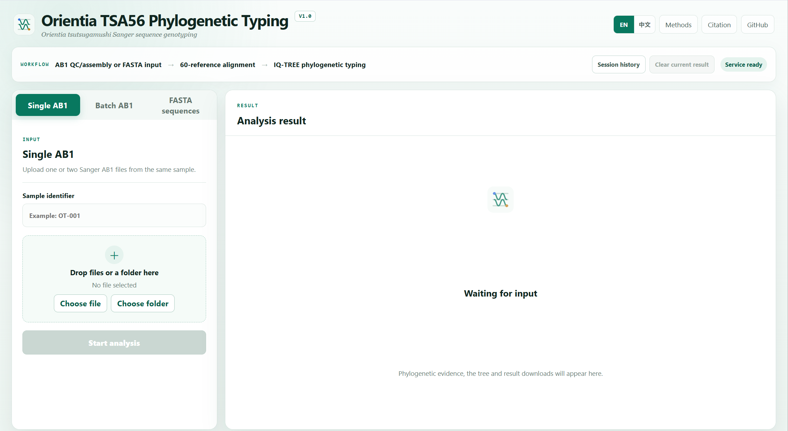

# Orientia TSA56 Phylogenetic Typing V1

**Website:** [https://orientia-tsutsugamushi-typing.org/](https://orientia-tsutsugamushi-typing.org/)

[English](README.md) | [简体中文](README.zh-CN.md)

A reproducible local web application for phylogenetic typing of *Orientia tsutsugamushi* TSA56 sequences. It accepts Sanger AB1 chromatograms and FASTA sequences and produces reference-aligned sequences, IQ-TREE phylogenies, genotype assignments and downloadable analysis records.

## Analysis interface



## Analysis workflow

1. AB1 input undergoes chromatogram QC, orientation and paired-read assembly; FASTA input starts at alignment.
2. Sample sequences are added to the curated 60-reference alignment with `mafft --add --keeplength`.
3. IQ-TREE uses `TVM+F+R5`, 1,000 ultrafast bootstrap replicates, device-adaptive `-T AUTO` and `-bnni`.
4. Genotypes are inferred from reference-anchored phylogenetic evidence. Unsupported or discordant results require manual review.

See [Methods](docs/METHODS.md) for the full analytical specification.

## Installation

Docker Desktop or Docker Engine with Compose is recommended. The container includes the application environment, MAFFT 7.525 and IQ-TREE 3.0.1.

### Windows

1. Install and start [Docker Desktop](https://docs.docker.com/desktop/setup/install/windows-install/).
2. Download and extract the tagged GitHub Release ZIP.
3. Open PowerShell in the extracted folder and run:

```powershell
powershell -ExecutionPolicy Bypass -File .\scripts\check_environment.ps1
powershell -ExecutionPolicy Bypass -File .\scripts\start_docker.ps1
```

### macOS or Linux

Install Docker Engine/Desktop with Compose, then run:

```sh
sh ./scripts/check_environment.sh
sh ./scripts/start_docker.sh
```

Open `http://localhost:3200/`. The API listens only on `127.0.0.1:8200`. Stop the containers with the matching `stop_docker` script. Results remain in the Docker volume after stopping.

Full instructions and the advanced native path are in [Local installation](docs/LOCAL_INSTALLATION.md). Troubleshooting is in [Troubleshooting](docs/TROUBLESHOOTING.md).

## Input and results

- Single AB1: one or two `.ab1` files.
- Batch AB1: multiple `.ab1` files, grouped by filename and analysed in one joint tree.
- FASTA: one `.fa/.fas/.fasta/.fna` file containing 1–100 sequences.
- Auditable outputs: JSON/HTML report, 60-reference alignment, IQ-TREE treefile/report/log/UFBoot/consensus tree, display Newick and SVG.

See [Input and output](docs/INPUT_OUTPUT.md). This research tool does not replace manual inspection of the phylogeny.

## Documentation

[Installation](docs/LOCAL_INSTALLATION.md) · [Methods](docs/METHODS.md) · [Input and output](docs/INPUT_OUTPUT.md) · [Validation](docs/VALIDATION.md) · [Troubleshooting](docs/TROUBLESHOOTING.md) · [Citation](docs/CITATION.md)

## Tests

```powershell
..\.venv\Scripts\python.exe -m pytest -q --basetemp=.pytest-tmp
cd frontend
node_modules\.bin\vinext.cmd build
node --test tests\*.test.mjs
```

## Licence

Project code is released under the MIT License. MAFFT, IQ-TREE and reference sequence data retain their own licences or database terms; see [Third-party notices](THIRD_PARTY_NOTICES.md).
